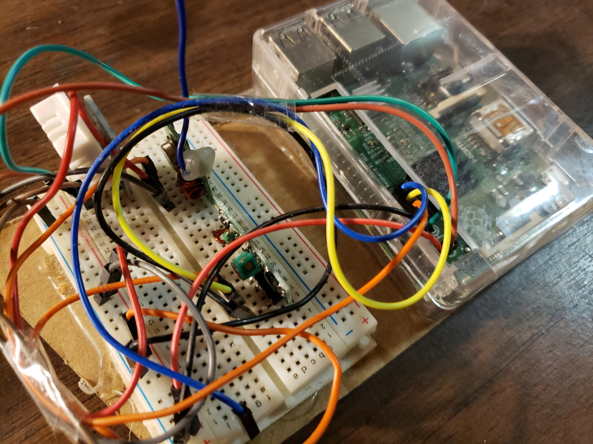
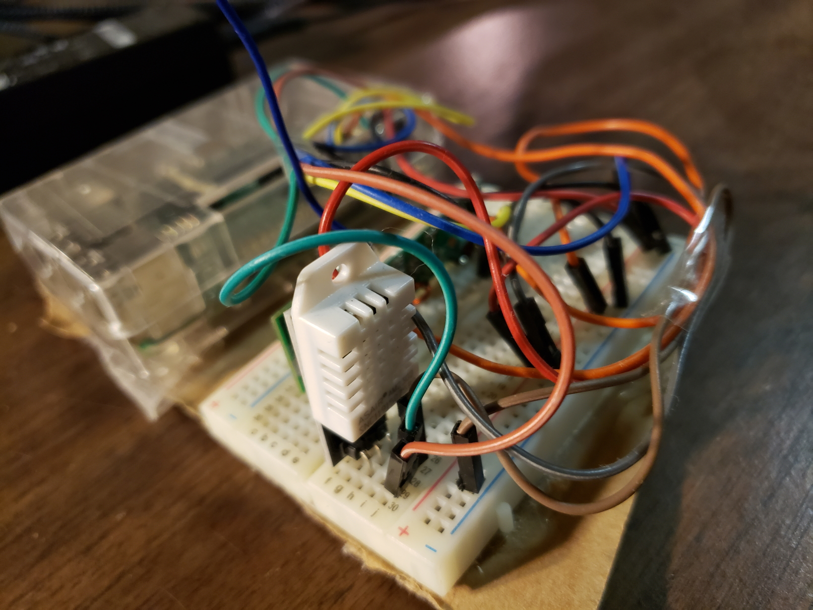
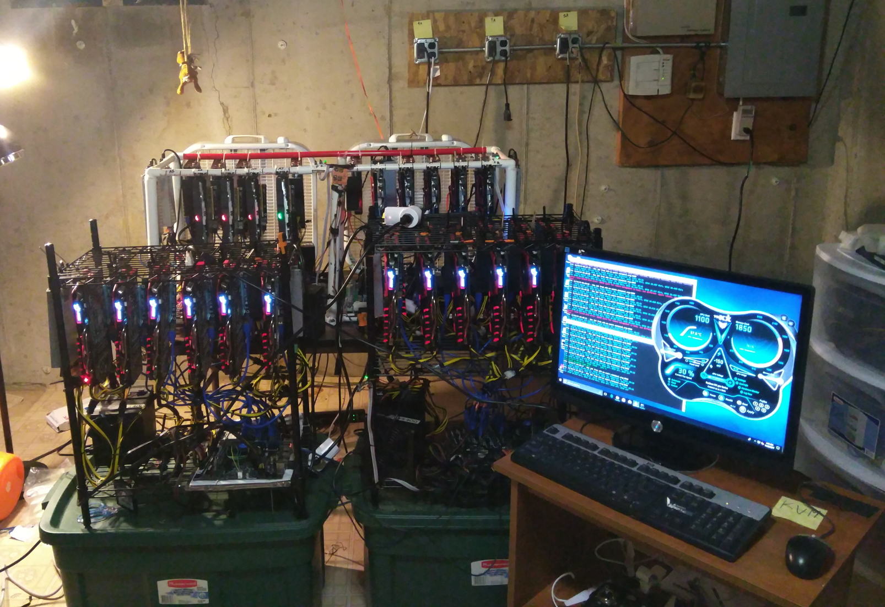

# Climate control RF

## A simple script that regulates a room's temperature

While I was running Cryptogold Mining, I had to figure out how to regulate the air temperature in an indoor environment in order to keep the equipment cool. Air conditioning wasn't an option due to the high power cost. So I decided to deploy window fans that were controllable via 433 MHz RF outlets.

But I ran into a problem: these power outlets could only be controlled manually with a handheld remote. I needed to switch the ventilation on and off automatically and remotely.

I wrote a script that automatically regulates the room's temperature based on the indoor temp, outdoor temp and humidity. The script fetches API weather data and compares it to an indoor sensor's readings. If it's colder outside than inside, the fan outlets are sent a signal to turn on. Vice versa, if the indoor readings become colder than the outside, the fans are turned off.

I then built a Raspberry Pi microcontroller that's linked to the DHT22 sensor and the radio transmitter. The program accesses the hardware GPIO pins of the RPi to read and send data.

I chose to use Node.js because Javascript is a versatile language and Node.js has strong IoT support. Another focus was to make the code as asynchronous as possible and reliable enough to not randomly crash. I learned how Promises work and how they are superior to callbacks.

### The project ended up being a success

I had to worry less about my computing equipment and more about the value/profit of the Ethereum and other coins that they were mining!

