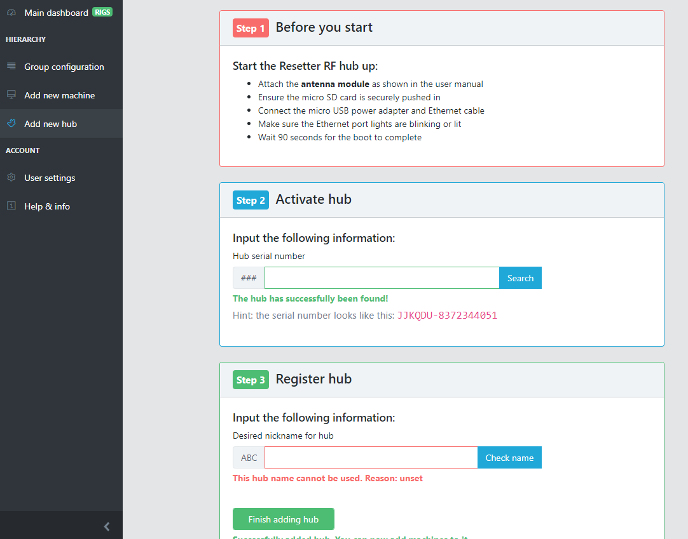
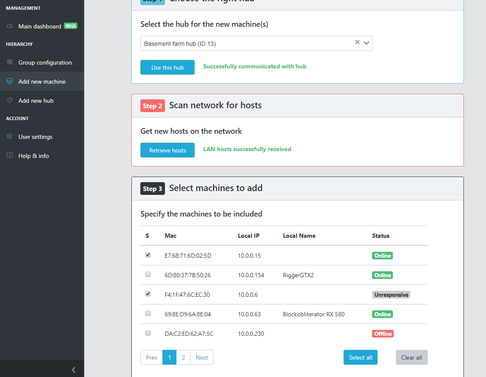
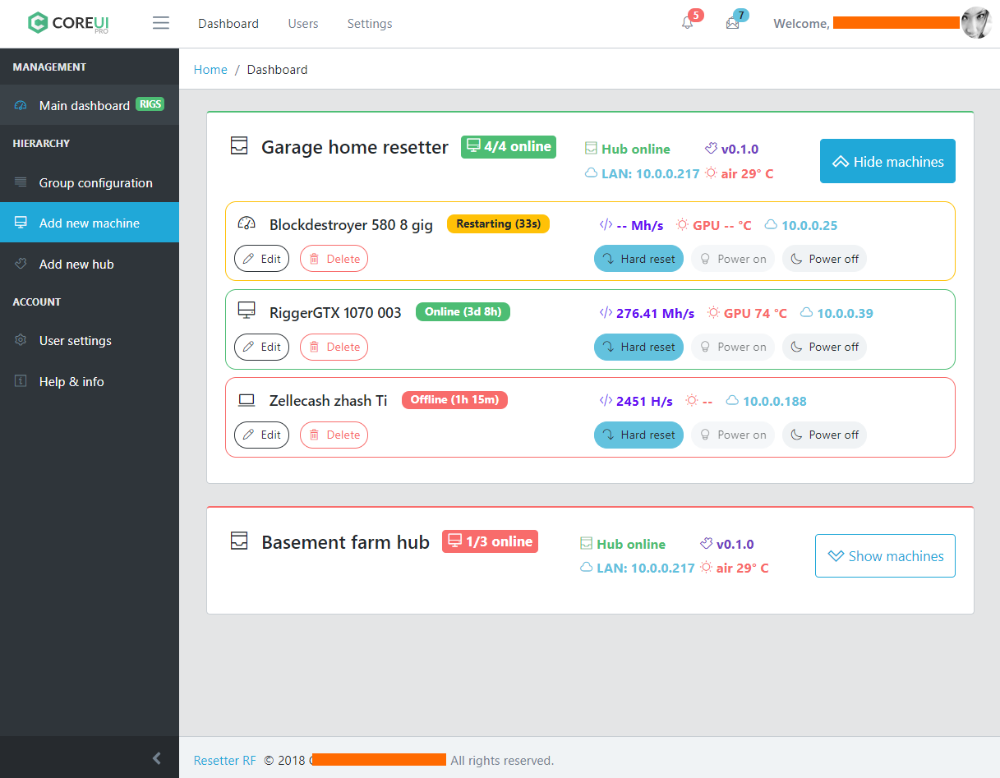

# Coinfarm front end

### A small portion of the code I wrote for Coinfarm Technologies

In early 2019, after several years in the crypto mining industry, I wanted to start a company that provided software for other Bitcoin mining farm owners to streamline their operations.

I and my business partner decided that the best software stack was Vue.js, Typescript, Node.js and Laravel. I learned the newer features of Javascript, like Promises, strict data typing and functional programming. This project solidified my understanding of JS for both the front and back end.

Here's a sample of a few front end pages of the admin control panel:

**Note:** the CoreUI template code has been omitted due to copyright considerations
