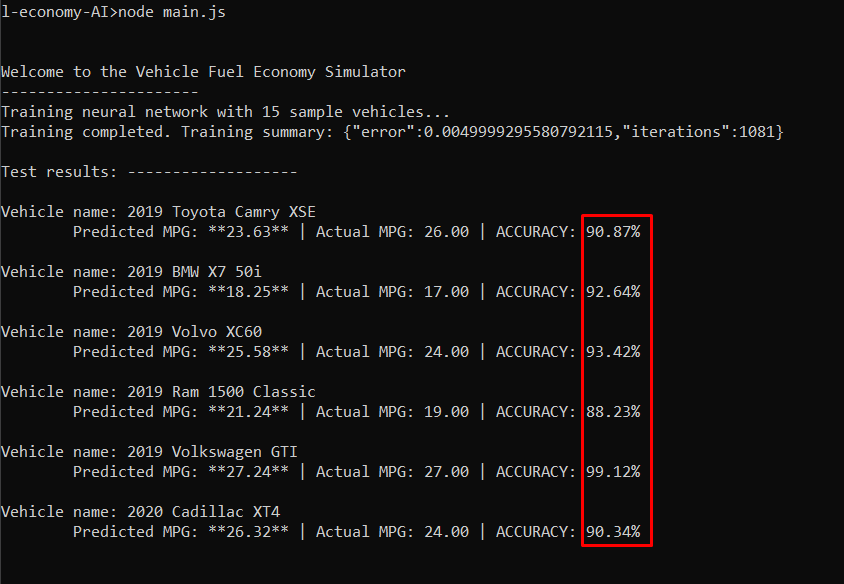

# Fuel economy AI

### Uses basic machine learning to develop and apply a regression model

This is a small program that I wrote in order to get started with machine learning. It relies on the popular and simple Brain.js library that trains a neural network based on input data. Then, when new data is fed into the network with an unknown answer, Brain.js estimates the solution.

I prepared example data in the `training-data.js` file, which contains 15 different vehicles. The engine volume and weight of the vehicle are the input values, and the MPG is the expected output value. The neural network processes these examples and builds an internal model that guesses the expected MPG given the engine size and the weight. Finally, the network is tested against 6 vehicles in the `test-data.js` file. The accuracy of the regression model is calculated and printed.

### The results

#### Pretty accurate, isn't it?
