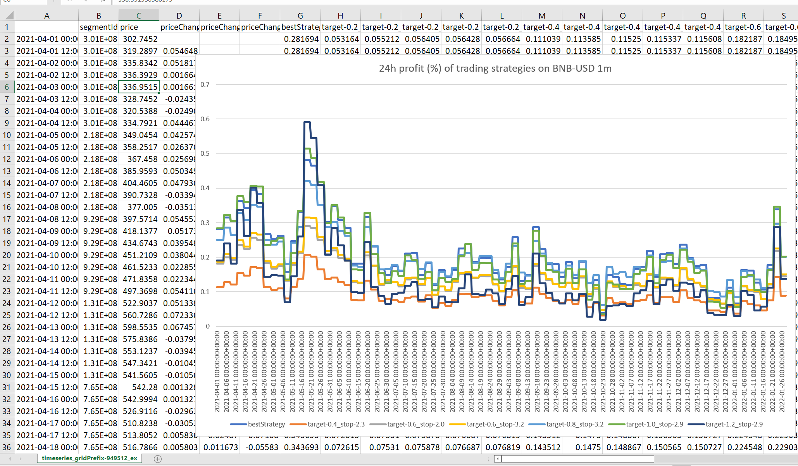
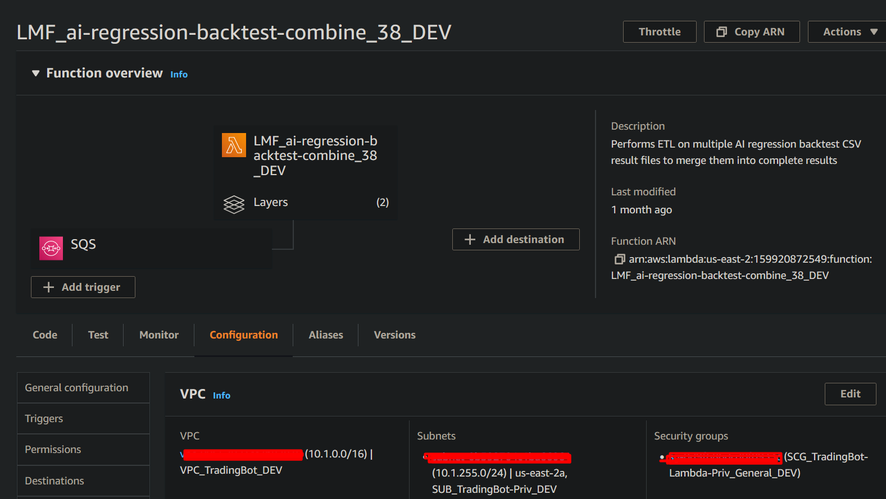
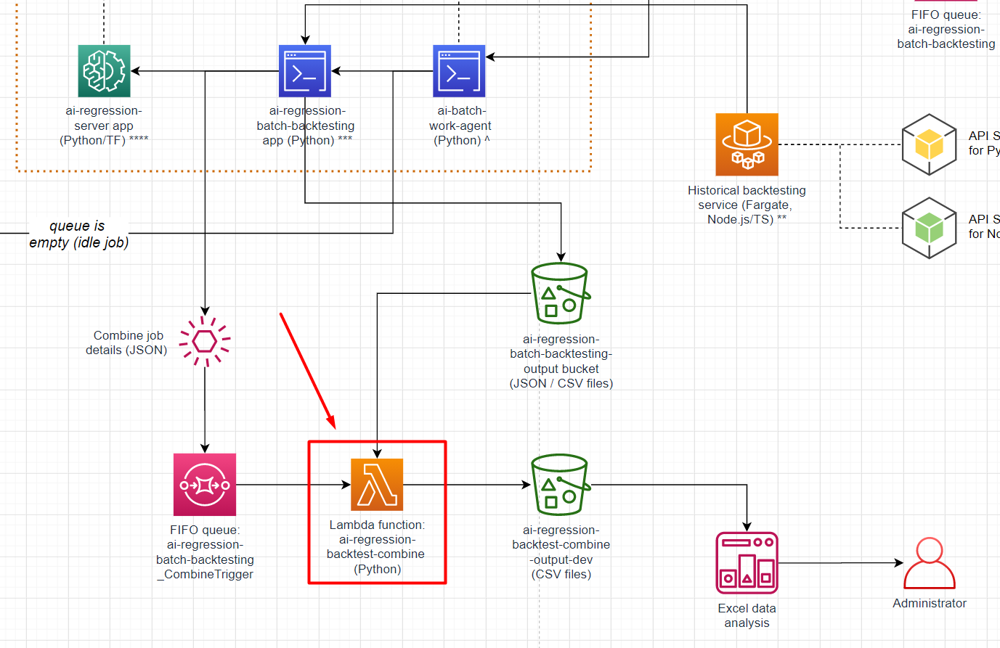

# Coinfarm trading bot | AI regression backtest combine

### This repository is an ETL process for merging the backtest results from multiple time periods with multiple strategy parameters together into one CSV file. Graphs of the trading results can be generated to evaluate how effective each strategy is.

### Python Pandas is used to splice, merge, compare and add DataFrames (which represent the CSV file). The output file contains data weaved together from multiple input files.

### Of course, this project is fully integrated with AWS:

* Historical price data from Coingecko is downloaded from an S3 bucket
* The application is deployed as a Lambda function with dependencies in 3 layers
* The function is triggered by an input event from a SQS queue after the backtest process is complete
* Private packages are stored in CodeArtifact
* Output is uploaded to an S3 bucket
* Profiling/tracing is enabled with AWS X-ray

I decided not to use a SAM template for local testing because it was overkill. A simple `launch.json` with an input event worked fine.

# Output

This is basically a graph of how effective each of these trading strategies are over an entire year. If the strategy works really well for a short time but fails afterward, that's a red flag.

In this case, the strategy does really well during times of high price volatility, which took place during May 2021 and January 2022. It profits regardless of whether the price goes up or down, which is great.

# Architecture

### Here's the entire backtest data pipeline:

