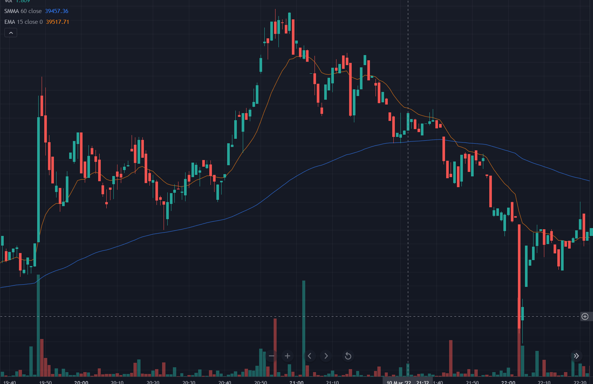
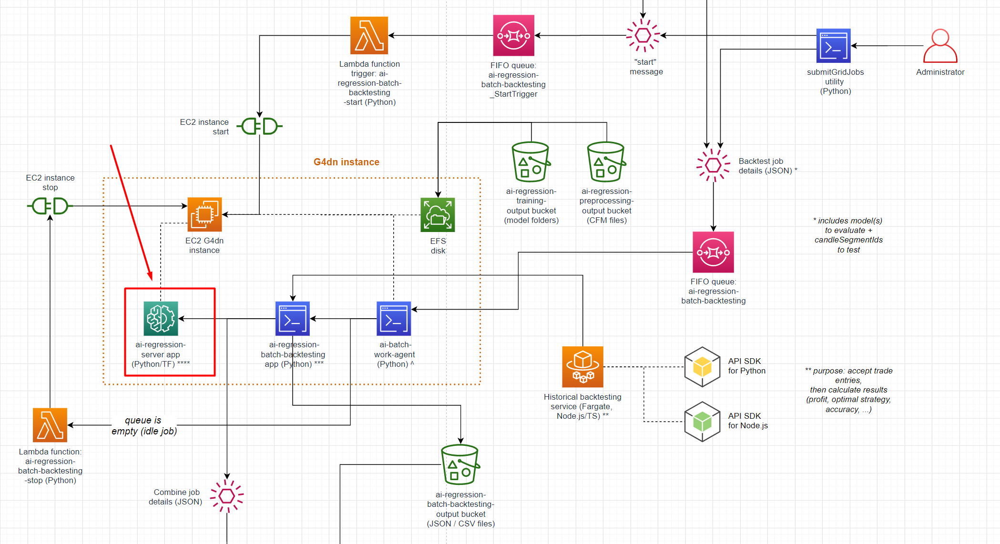

# Coinfarm trading bot | AI regression server

### This repository is an AI model inference web server built with Python + FastAPI + Tensorflow 2 + Keras. The server predicts the returns of crypto trading market charts in order to backtest whether or not a model can make profit.

### The model ended up being correct ~72% of the time, but unfortunately, that wasn't enough to clear the trading fees. It never proved to make any money during backtesting.

### Of course, this project is fully integrated with AWS:

* The Keras model files are stored in an S3 bucket
* The application can run on about 30 EC2 G4dn instances in an auto scaling group; predicting 2 years of BTC / ETH / LTC chart history in under 1 hour
* The application is integrated with API Gateway via OpenAPI 3
* Private packages are stored in CodGaeArtifact

# Input

The input data is a batch (50-100 samples) of binary 'images' (resolution: 200x150x3), which is 200 candles x 3 dimensions (open-close, low-high, volume. 



These images have been generated from JSON candlestick data from the Binance.us exchange. The reason they have to be images is the model is convolutional. If it were a recurrent model, I could just convert the candle prices directly to arrays.

These images are then inferred against a pretrained model. The model contains 2 million parameters across 25-30 layers, trained on millions of candlestick frames across multiple coins and bull/bear markets. The training process takes 48 hours on an on-premises 3x RTX 3080 system. That system saved over $2000 in EC2 costs, plus it was a nice tax write-off.

# Output

Here's an example of the output:

These percentages are predictions of return for the next 30 candles.

```json
{
	[
		// This chart has been predicted to be bullish
		"predictions": {
			"maxRisePct": 0.4284106, //maximum % price rise
			"maxDeclinePct": -0.0084481, //maximum % price decline
			"endChangePct": 0.1894498 //new price after 30 candles
		}
	],
	[
		// This chart has been predicted to be bearish
		"predictions": {
			"maxRisePct": 0.189756,
			"maxDeclinePct": -1.561498,
			"endChangePct": -0.31890054
		}
	],
	...
}
```

This server can run on a CPU or GPU. With a decent GPU, predicting a single frame takes < 50 ms. This makes it suitable for real-time trading. It can read chart patterns much faster than a human trader.

# Architecture

This application is part of a backtesting data pipeline:


