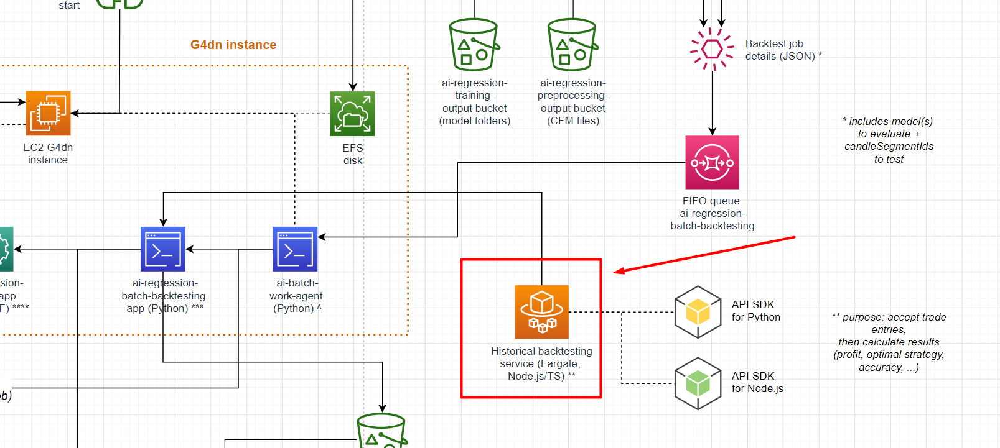

# Coinfarm trading bot | Historical backtesting server

### This repository is a web server based on the up-and-coming [Nest.js](https://nestjs.com/) application framework for Node.js. The code is written in 100% Typescript, which accelerated development and prevented bugs. DTO classes are compiled to JSON schemas, which Nest validates input requests against.

### Of course, this project is fully integrated with AWS:

* The service is hosted on an ECS Fargate container cluster which auto-scales according to traffic. The Docker images are stored in ECR.
* The application uses CodeCommit + CodePipeline for CI/CD. The new Docker image is deployed to the Fargate cluster automatically, on a rolling basis. The service continues working with no downtime.
* The application makes requests to the historical data service (HDS), another Fargate Nest.js microservice, within the private VPC network.
* A Route 53 Hosted Zone is used for load balancing. Fargate registers the service with Cloud Map.
* The application is integrated with API Gateway via Nest OpenAPI extensions.
* Private packages are stored in CodeArtifact

Why not Python? Because in my opinion, Typescript & Node.js are better suited for web applications, while Python is better for data science. It wasn't too hard to auto-generate Python SDK clients from the OpenAPI schema.

# Input

The input data is an HTTP POST request containing a JSON payload. 

The JSON object contains information about the chart/coin to test, the price to enter the trade at, the conditions (exit strategies) under which to close the trade, and the exchange fee. 

The payload can have hundreds of trades in it, which happens during batch backtesting. This example only has 1 trade.

```json
{
    "segmentParams": {
        "exchange_domainName": "binance.us",
        "exchange_name": "BinanceUS",
        "segmentId": "278503792"
    },
    "entryInfo": {
        "entryType": "bullish",
        "entryCandle": {
            "openTime": "2021-06-04T05:36:00.000Z",
            "closeTime": "2021-06-04T05:36:59.999Z",
            "prices": {
				"open": 381,
				"high": 381.3062,
				"low": 375,
				"close": 380.2831
			},
			"volumes": {
				"base": 844.16
			}
        },
		"entryQty": 1
    },
    "exitStrategy": {
        "name": "commodo dolore irure",
        "profitSubStrategies": [
            {
                "name": "ProfitExitStrategy_TargetLimit",
				"fixedPriceTarget": 385
            }
        ],
        "lossSubStrategies": [
			{
                "name": "LossExitStrategy_Stop",
				"fixedStopPrice": 374
            }
        ]
    },
    "tradeFeeInfo": {
        "name": "BinanceUS_DefaultFeeTier_BNB_20Discount",
        "makerFeePct": 0.06,
        "takerFeePct": 0.06
    }
}
```

# Output

Here's an example of the output:

The result contains data on the profit margin of the trade, time to exit, and fees charged. This is an example of a profitable trade. 

```json
{
    "result": {
        "entryInfo": {
            ...
        },
        "exitInfo": {
            "exitCandle": {
                "openTime": "2021-06-04T06:05:00.000Z",
                "closeTime": "2021-06-04T06:05:59.999Z",
                "prices": {
                    "open": 384.7906,
                    "high": 386.371,
                    "low": 384.7906,
                    "close": 385.8939
                },
                "volumes": {
                    "base": 152.11
                }
            },
            "exitCandles": 29,
            "exitPrice": 384.769,
            "exitPrice_noFee": 385,
            "exitQty": 1,
            "exitRevenue": 384.769,
            "exitRevenue_noFee": 385,
            "priceTargetReached": true,
            "strategyExited": {
                "name": "ProfitExitStrategy_TargetLimit",
                "fixedPriceTarget": 385
            }
        },
        "feeInfo": {
            "feeTier": {
                "name": "BinanceUS_DefaultFeeTier_BNB_20Discount",
                "makerFeePct": 0.06,
                "takerFeePct": 0.06
            },
            "entry_feeType": "taker",
            "exit_feeType": "taker",
            "entry_feeCharged": 0.22859999999997171,
            "exit_feeCharged": 0.23099999999999454,
            "totalFeeCharged": 0.45959999999996626
        },
        "profitInfo": {
            "profit": 3.5404000000000337,
            "profit_noFee": 4,
            "profitMargin": 0.009286816361626683,
            "profitMargin_noFee": 0.010498687664041995
        }
    },
    "performance": {
        "initTimeMs": 0,
        "operationTimeMs": 0
    }
}
```

This is a losing trade:

```json
{
    "result": {
        "entryInfo": {
            ...
        },
        "exitInfo": {
            "exitCandle": {
                "openTime": "2021-06-04T12:39:00.000Z",
                "closeTime": "2021-06-04T12:39:59.999Z",
                "prices": {
                    "open": 378.9746,
                    "high": 381.8694,
                    "low": 378.6185,
                    "close": 381.6968
                },
                "volumes": {
                    "base": 213.7
                }
            },
            "exitCandles": 41,
            "exitPrice": 380.228,
            "exitPrice_noFee": 380,
            "exitQty": 1,
            "exitRevenue": 380.228,
            "exitRevenue_noFee": 380,
            "priceTargetReached": false,
            "strategyExited": {
                "name": "LossExitStrategy_Stop",
                "fixedStopPrice": 380
            }
        },
        "feeInfo": {
            "feeTier": {
                "name": "BinanceUS_DefaultFeeTier_BNB_20Discount",
                "makerFeePct": 0.06,
                "takerFeePct": 0.06
            },
            "entry_feeType": "taker",
            "exit_feeType": "taker",
            "entry_feeCharged": 0.22618835999998055,
            "exit_feeCharged": 0.22800000000000864,
            "totalFeeCharged": 0.4541883599999892
        },
        "profitInfo": {
            "profit": -3.473588360000008,
            "profit_noFee": -3.0194000000000187,
            "profitMargin": -0.009219768243401818,
            "profitMargin_noFee": -0.008009430724021393
        }
    },
    "performance": {
        "initTimeMs": 0,
        "operationTimeMs": 1
    }
}
```

# Architecture

This application is part of a backtesting data pipeline:



I would've wrote unit tests with Jest if I had enough time to develop this.