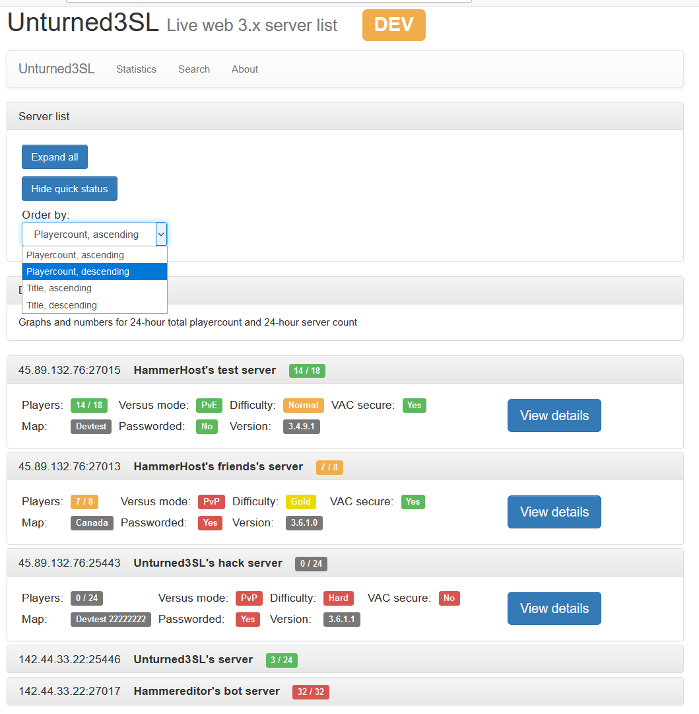
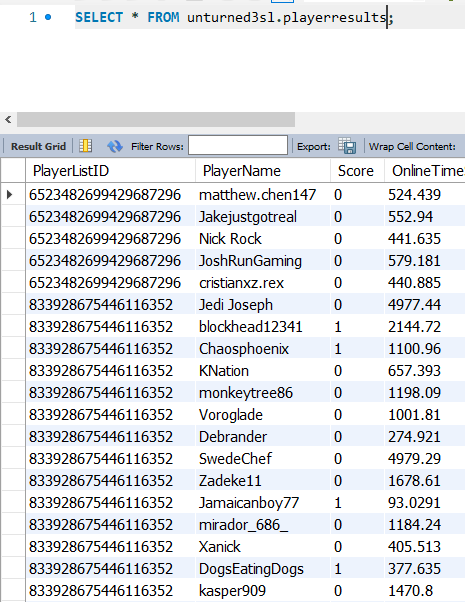

# Unturned 3 server list website

### A small web application for tracking players in an online game

In 2015, I was very interested in databases and big data analysis. I was also playing an online game called 'Unturned', which is a multiplayer survival game where players harvest resources from the environment and compete to build fortified bases and survive.

I decided to create a website that tracked game servers and players. There were [competing server list sites](https://unturned-servers.net/) that provided information on the servers, but not the players. I wanted my site to track the individual players and answer questions like:

    1. **Who are the top ranked Unturned players and which servers do they like?**
    2. **Is there any way to use data to predict when a server is about to become popular?**
    3. **Which regions/countries tend to attract which players?**

My program uses the [Steamworks API](https://partner.steamgames.com/doc/sdk/api) and connects to UDP port 27015-27100 of these game servers to fetch the stats and information on the players. It then stores the results in a MySQL database to be used and studied later. I decided to use JSP because I was familiar with Java. I used Bootstrap for the front end.

I let the application run for a few months, and it managed to collect 300 million rows of player data! The database was 30GB in size. I should've designed my tables better, since some of the information was repetitive...

#### Here's an example of some of the data:

I decided to abandon the project because Unturned started becoming less popular. I wasn't learning anything new as well.
